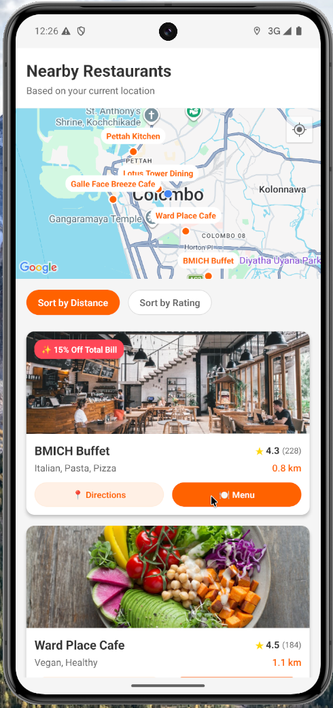
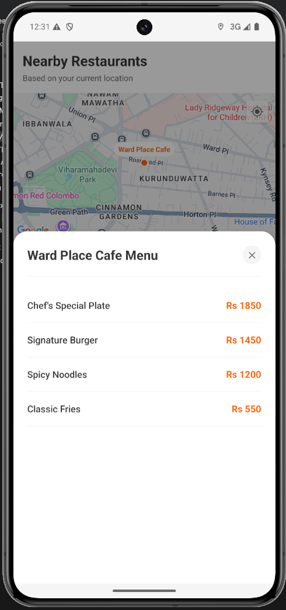

# 🍽️ RestaurantApp

A beautiful, fully-functional React Native application that discovers nearby restaurants based on your device's geographical location, calculates distances, and dynamically renders restaurant menus natively using optimized map markers and custom modal components!

## ✨ Features

* **📍 Device Location Tracking:** Automatically requests device permissions and fetches your current `latitude` & `longitude`.
* **🗺️ Interactive MapView:** Integrates natively with the Google Maps SDK to drop dynamic markers on nearby restaurants.
* **📱 Beautiful Custom UI:** Renders rich `RestaurantCard`s complete with rounded images, floating discount badges, and a custom UI library.
* **🍽️ Dynamic Menus:** Features a scalable `MenuModal` component that dynamically maps strictly-typed object arrays into ScrollViews.
* **📏 Distance Sorting:** Computes distance algorithms and naturally sorts nearby restaurants by geographical proximity or rating.
* **🧱 Modern State Management:** Uses extracted custom Hooks (`useRestaurants.ts`) to securely decouple Business Logic states cleanly away from the UI Layout.

## 📸 Screenshots
<p align="center">
  
  
</p>

## 🚀 Getting Started

### 1. Prerequisites
Ensure you have the React Native CLI environment natively setup on your machine.
- Node.js & npm
- Xcode (for iOS)
- Android Studio (for Android)

### 2. Installation
Clone the repository and install the dependencies:
```bash
# Install NPM dependencies
npm install

# Install iOS CocoaPods
cd ios && pod install && cd ..
```

### 3. API Keys (Google Maps SDK)
This project requires a Google Maps API Key to render the interactive `<MapView>` component.

> [!WARNING]
> **Security Notice:** API keys should never be hardcoded into native project files in a public repository due to automated scraping bots. It is highly recommended to implement a local `.env` parser or to explicitly add `AndroidManifest.xml` and `AppDelegate.swift` to the repository's `.gitignore` file prior to inserting any real API keys.

**For iOS:** Open `ios/RestaurantApp/AppDelegate.swift` and replace the placeholder API Key:
```swift
GMSServices.provideAPIKey("YOUR_KEY_HERE")
```

**For Android:** Open `android/app/src/main/AndroidManifest.xml` and insert your API Key:
```xml
<meta-data
    android:name="com.google.android.geo.API_KEY"
    android:value="YOUR_KEY_HERE"/>
```

---

## 🛠️ Running the App

Start the Metro Bundler:
```bash
npm start
```

Run on iOS Simulator:
```bash
npm run ios
```

Run on Android Emulator:
```bash
npm run android
```

---

## 🏗️ Technical Architecture 

- **Language:** TypeScript (`strict` mode enabled)
- **Framework:** React Native (Bare Workflow)
- **Styling:** Vanilla `StyleSheet` objects scoped to individual component lifecycles.
- **Maps:** `react-native-maps` mapped natively to Google Maps.
